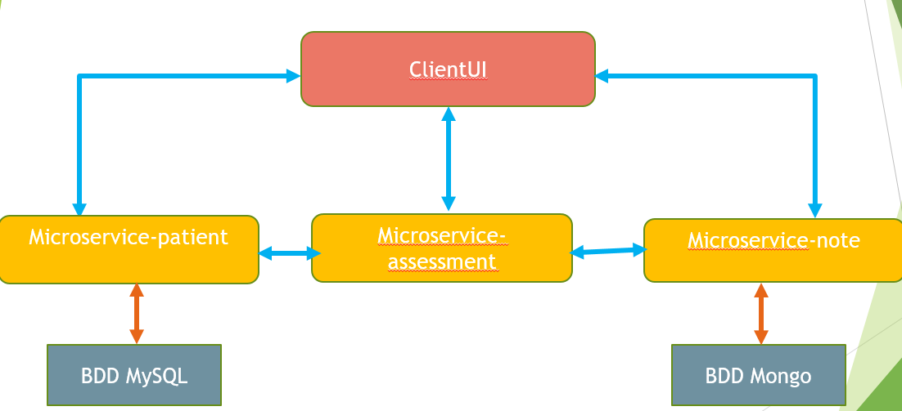
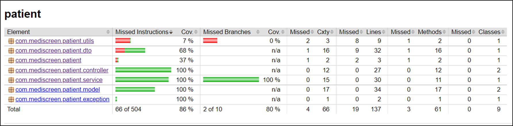
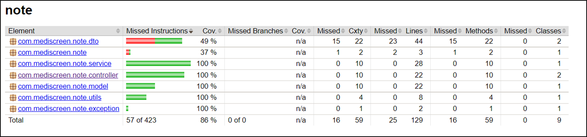
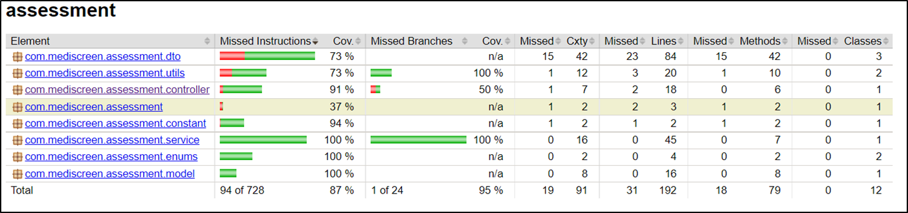

## Project: MEDISCREEN


Mediscreen is an application for health clinics and private practices to screen for disease risks
based on the history of doctors' notes. 

## Technical used:

1. Framework: Spring Boot v2.7.2
2. Java 11
3. Maven 3.8.4
4. Docker v 20.10.17
5. Junit 5
6. Mockito
7. MongoDB
8. MySQL
9. Thymleaf 
10. Bootstrap 4.6.0

## Architecture :



## Getting Started

These instructions will get you a copy of the project up and running on your local machine for development and testing purposes.

## Installation & Running

Before you continue, ensure you meet the following requirements:

1. Install docker compose:

https://docs.docker.com/compose/install/

2. Build the jar for each microservice :

Go to the principal folder where is build.bat in and run the command : ```.\build.bat```

3. When all jars are built, perform the command. : ```docker-compose up -d ```

4. To stop the application run the command : ```docker-compose down ```


## Testing

To run test for each microservice, execute the command: ``` .\test.bat ```
To see the packages tested and their coverage, access to file directory: target/site/jacoco in each microservice and run the file index.html in your web browser

## Reports test





